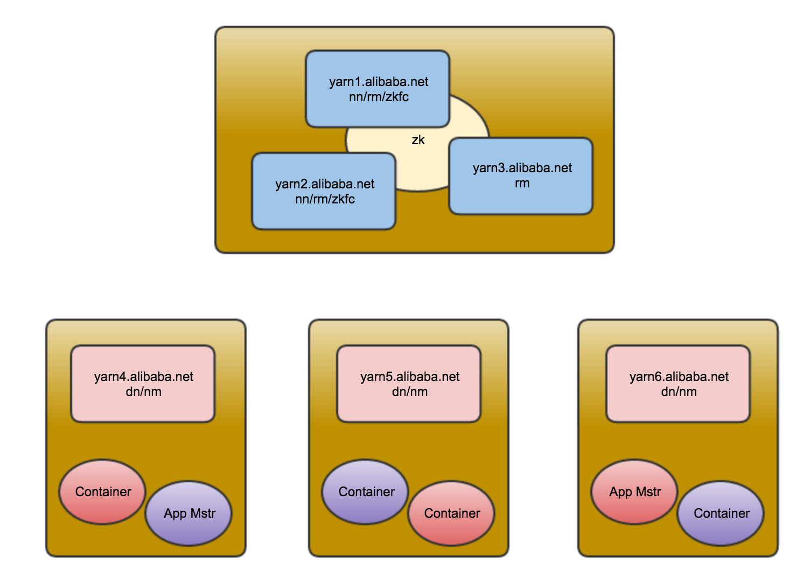
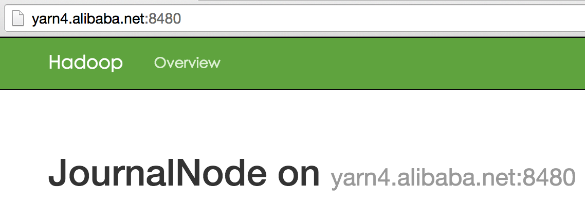
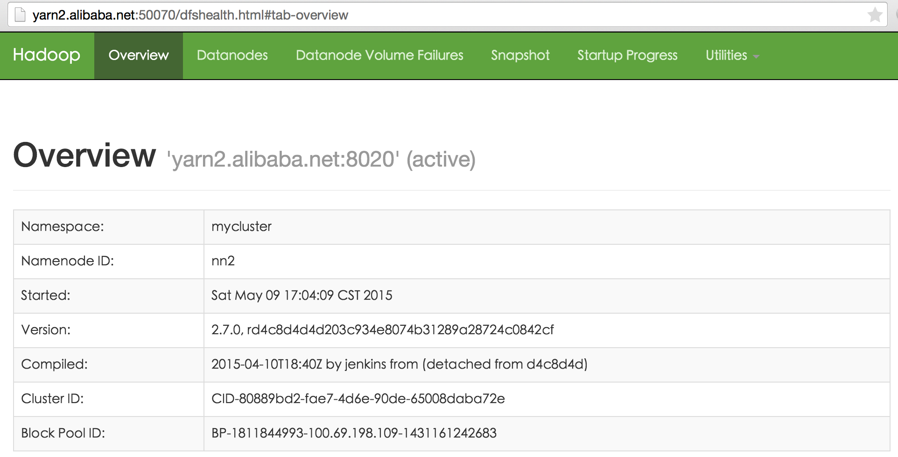
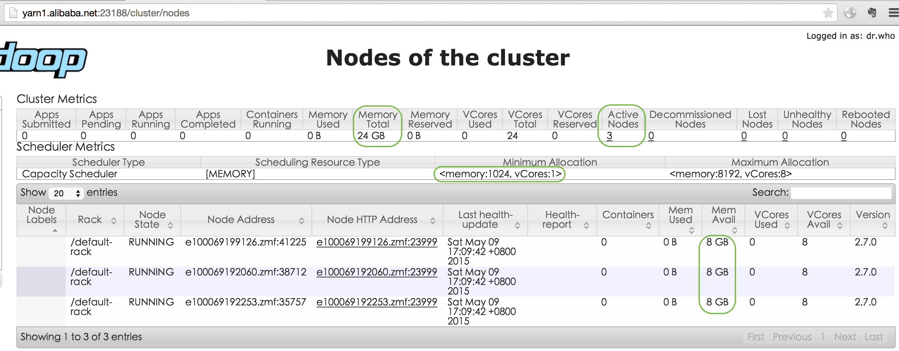

yarn cluster
----
## 1. Concepts

- nn:NameNode
 - nna:NameNode Active
 - nns:NameNode Standby
- snn:Secondary NameNode
- rm:ResourceManager
- zkfc:Zookeeper Failover Controller
- dn:DataNode
- nm:NodeManager
- jn:JournalNode

## 2. Plan
### 2.1 Servers
|Host|IP|Hostname|Daemon|Resources|
|:--|:--|:--|:--|:--|
|yarn1.alibaba.net|100.69.198.109|e100069198109.zmf|nn,zkfc,rm|[2CPU,4096M]|
|yarn2.alibaba.net|100.69.199.164|e100069199164.zmf|nn,zkfc,rm|[2CPU,4096M]|
|yarn3.alibaba.net|100.69.199.142|e100069199142.zmf|rm|[2CPU,4096M]|
|yarn4.alibaba.net|100.69.192.60|e100069192060.zmf|dn,jn,nm|[4CPU,8192M]|
|yarn5.alibaba.net|100.69.199.126|e100069199126.zmf|dn,jn,nm|[4CPU,8192M]|
|yarn6.alibaba.net|100.69.192.253|@e100069192253.zmf|dn,jn,nm|[4CPU,8192M]|

### 2.2 Topology


## 3. Configuration

### 3.1 Unified Version

1. OS: Alibaba Group Enterprise Linux Server release 5.7 (CatFeces)
1. Kenel: Linux 2.6.32-220.23.2.ali927.el5.x86_64
1. JDK: 1.8.0_45-b14 Java HotSpot(TM) 64-Bit Server VM (build 25.45-b02, mixed mode)
1. HADOOP: hadoop-2.7.0

### 3.2 Common Setting

#### 3.2.1 Firewall
- all

```
sudo service iptables stop
sudo service iptables status
```
> Firewall is stopped.

#### 3.2.2 SSH
- Han-Yosemite.local

```shell
for n in yarn1 yarn2 yarn3 yarn4 yarn5 yarn6; do
	ssh-copy-id -i ~/.ssh/id_rsa.pub lu.hl@$n.alibaba.net
    scp id_rsa* lu.hl@$n.alibaba.net:/home/lu.hl/.ssh
done
```
#### 3.2.3 Global Environment
/etc/profile

```shell
export JAVA_HOME=/opt/jdk1.8.0_45/
export HADOOP_HOME=/opt/hadoop-2.7.0
export HADOOP_PREFIX=$HADOOP_HOME
export HADOOP_BIN=$HADOOP_HOME/bin
export HADOOP_CONF_DIR=$HADOOP_HOME/etc/hadoop
export PATH=$PATH:$JAVA_HOME/bin:$HADOOP_BIN
```
### 3.3 Hadoop Setting

#### 3.3.1 hadoop-env.sh
nano $HADOOP_CONF_DIR/hadoop-env.sh

```shell
export JAVA_HOME=/opt/jdk1.8.0_45/
```

#### 3.3.2 yarn-env.sh
nano $HADOOP_CONF_DIR/yarn-env.sh

```shell
#Yarn Daemon Options
#export YARN_RESOURCEMANAGER_OPTS
#export YARN_NODEMANAGER_OPTS
#export YARN_PROXYSERVER_OPTS
#export HADOOP_JOB_HISTORYSERVER_OPTS

#Yarn Logs
export YARN_LOG_DIR="${user.home}/hadoop/logs"
```

#### 3.3.3 core-site.xml
nano $HADOOP_CONF_DIR/core-site.xml

```xml
<?xml version="1.0"?>
<?xml-stylesheet type="text/xsl" href="configuration.xsl"?>
<configuration>
  <property>
    <name>fs.defaultFS</name>
    <value>hdfs://mycluster</value>
    <description>NameNode URI</description>
  </property>

<!--HDFS超级用户 -->
  <property>
    <name>dfs.permissions.superusergroup</name>
    <value>lu.hl</value>
  </property>
  <property>
    <name>ha.zookeeper.quorum</name>
    <value>zk1.alibaba.net:2181,zk2.alibaba.net:2181,zk3.alibaba.net:2181</value>
  </property>
</configuration>
```

#### 3.3.4 hdfs-site.xml
nano $HADOOP_CONF_DIR/hdfs-site.xml

> It doesn't support three namenodes, according to /opt/hadoop-2.7.0/logs/hadoop-lu.hl-namenode-e100069198109.zmf.log:
>
java.lang.IllegalArgumentException: Expected exactly 2 NameNodes in namespace 'mycluster'. Instead, got only 3 (NN ids were 'nn1','nn2','nn3'

```xml
<?xml version="1.0" encoding="UTF-8"?>
<?xml-stylesheet type="text/xsl" href="configuration.xsl"?>
<configuration>
  <property>
    <name>dfs.webhdfs.enabled</name>
    <value>true</value>
  </property>
  <property>
    <name>dfs.namenode.name.dir</name>
    <value>file://${user.home}/hadoop/data/dfs/name</value>
    <description>namenode name table(fsimage) directory</description>
  </property>
  <property>
    <name>dfs.namenode.edits.dir</name>
    <value>${dfs.namenode.name.dir}</value>
    <description>namenode transaction file(edits) directory</description>
  </property>
  <property>
    <name>dfs.datanode.data.dir</name>
    <value>${user.home}/hadoop/data/dfs/data</value>
    <description>datanode block directory</description>
  </property>
  <property>
    <name>dfs.replication</name>
    <value>1</value>
  </property>

<!-- namenode HA-->
  <property>
    <name>dfs.nameservices</name>
    <value>mycluster</value>
  </property>
  <property>
    <name>dfs.ha.namenodes.mycluster</name>
    <value>nn1,nn2</value>
  </property>
  <!-- rpc -->
  <property>
    <name>dfs.namenode.rpc-address.mycluster.nn1</name>
    <value>yarn1.alibaba.net:8020</value>
  </property>
  <property>
    <name>dfs.namenode.rpc-address.mycluster.nn2</name>
    <value>yarn2.alibaba.net:8020</value>
  </property>

  <!-- http -->
  <property>
    <name>dfs.namenode.http-address.mycluster.nn1</name>
    <value>yarn1.alibaba.net:50070</value>
  </property>
  <property>
    <name>dfs.namenode.http-address.mycluster.nn2</name>
    <value>yarn2.alibaba.net:50070</value>
  </property>

  <!-- namenode editlog sync -->
  <property>
    <name>dfs.journalnode.http-address</name>
    <value>0.0.0.0:8480</value>
  </property>
  <property>
    <name>dfs.journalnode.rpc-address</name>
    <value>0.0.0.0:8485</value>
  </property>
  <property>
    <name>dfs.namenode.shared.edits.dir</name>
    <value>qjournal://yarn4.alibaba.net:8485;yarn5.alibaba.net:8485;yarn6.alibaba.net:8485/mycluster</value>
  </property>
  <property>
    <name>dfs.journalnode.edits.dir</name>
    <value>${user.home}/hadoop/data/dfs/jn</value>
  </property>

<!-- datanode -->
  <property>
    <name>dfs.datanode.http.address</name>
    <value>0.0.0.0:8075</value>
  </property>
  <property>
    <name>dfs.namenode.edits.journal-plugin.qjournal</name>
    <value>org.apache.hadoop.hdfs.qjournal.client.QuorumJournalManager</value>
  </property>

  <!-- dataNode editlog sync -->
  <property>
    <!--DataNode,Client连接Namenode识别选择Active NameNode策略 -->
    <name>dfs.client.failover.proxy.provider.mycluster</name>
    <value>org.apache.hadoop.hdfs.server.namenode.ha.ConfiguredFailoverProxyProvider</value>
  </property>

<!-- failover -->
  <property>
    <name>dfs.ha.fencing.methods</name>
    <value>sshfence(${user.name}:22)</value>
  </property>
  <property>
    <name>dfs.ha.fencing.ssh.private-key-files</name>
    <value>${user.home}/.ssh/id_rsa</value>
  </property>
  <property>
    <name>dfs.ha.automatic-failover.enabled</name>
    <value>true</value>
  </property>
  <property>
    <name>ha.zookeeper.quorum</name>
    <value>zk1.alibaba.net:2181,zk2.alibaba.net:2181,zk3.alibaba.net:2181</value>
  </property>
</configuration>
```

#### 3.3.5 yarn-site.xml
nano $HADOOP_CONF_DIR/yarn-site.xml

```xml
<?xml version="1.0"?>
<configuration>
<!-- one machine one conf -->
  <property>
    <name>yarn.resourcemanager.ha.id</name>
    <value>rm1</value>
  </property>

<!-- resourcemanager HA-->
  <property>
      <name>yarn.resourcemanager.ha.enabled</name>
      <value>true</value>
  </property>
  <property>
    <name>yarn.resourcemanager.ha.automatic-failover.embedded</name>
    <value>true</value>
  </property>
  <property>
      <name>yarn.resourcemanager.ha.automatic-failover.enabled</name>
      <value>true</value>
  </property>

  <property>
      <name>yarn.resourcemanager.cluster-id</name>
      <value>mycluster-yarn</value>
  </property>  
  <property>
      <name>yarn.resourcemanager.ha.rm-ids</name>
      <value>rm1,rm2,rm3</value>
  </property>

  <property>
      <name>yarn.resourcemanager.hostname.rm1</name>
      <value>yarn1.alibaba.net</value>
  </property>
  <property>
      <name>yarn.resourcemanager.hostname.rm2</name>
      <value>yarn2.alibaba.net</value>
  </property>
  <property>
      <name>yarn.resourcemanager.hostname.rm3</name>
      <value>yarn3.alibaba.net</value>
  </property>

  <property>
      <name>yarn.resourcemanager.recovery.enabled</name>
      <value>true</value>
  </property>
  <property>
      <name>yarn.resourcemanager.store.class</name>
      <value>org.apache.hadoop.yarn.server.resourcemanager.recovery.ZKRMStateStore</value>
  </property>
  <property>
      <name>yarn.resourcemanager.zk-address</name>
      <value>zk1.alibaba.net:2181,zk2.alibaba.net:2181,zk3.alibaba.net:2181</value>
  </property>
  <property>
      <name>yarn.resourcemanager.zk-state-store.address</name>
      <value>zk1.alibaba.net:2181,zk2.alibaba.net:2181,zk3.alibaba.net:2181</value>
  </property>

  <property>
      <name>yarn.app.mapreduce.am.scheduler.connection.wait.interval-ms</name>
      <value>5000</value>
  </property>
  <property>
      <name>yarn.resourcemanager.ha.automatic-failover.zk-base-path</name>
      <value>/yarn-leader-election</value>
  </property>
<!-- AM访问RM的RPC(scheduler interface) -->
  <property>
    <name>yarn.resourcemanager.address.rm1</name>
    <value>yarn1.alibaba.net:23140</value>
    </property>
  <property>
    <name>yarn.resourcemanager.address.rm2</name>
    <value>yarn2.alibaba.net:23140</value>
    </property>
  <property>
    <name>yarn.resourcemanager.address.rm3</name>
    <value>yarn3.alibaba.net:23140</value>
    </property>

  <property>
    <name>yarn.resourcemanager.scheduler.address.rm1</name>
    <value>yarn1.alibaba.net:23130</value>
    </property>
  <property>
    <name>yarn.resourcemanager.scheduler.address.rm2</name>
    <value>yarn2.alibaba.net:23130</value>
    </property>
  <property>
    <name>yarn.resourcemanager.scheduler.address.rm3</name>
    <value>yarn3.alibaba.net:23130</value>
    </property>

  <property>
    <name>yarn.resourcemanager.admin.address.rm1</name>
    <value>yarn1.alibaba.net:23141</value>
    </property>
  <property>
    <name>yarn.resourcemanager.admin.address.rm2</name>
    <value>yarn2.alibaba.net:23141</value>
    </property>
  <property>
    <name>yarn.resourcemanager.admin.address.rm3</name>
    <value>yarn3.alibaba.net:23141</value>
    </property>

<!--NM访问RM的RPC -->
  <property>
    <name>yarn.resourcemanager.resource-tracker.address.rm1</name>
    <value>yarn1.alibaba.net:23125</value>
    </property>
  <property>
    <name>yarn.resourcemanager.resource-tracker.address.rm2</name>
    <value>yarn2.alibaba.net:23125</value>
    </property>
  <property>
    <name>yarn.resourcemanager.resource-tracker.address.rm3</name>
    <value>yarn3.alibaba.net:23125</value>
    </property>

<!-- RM web application -->
  <property>
    <name>yarn.resourcemanager.webapp.address.rm1</name>
    <value>yarn1.alibaba.net:23188</value>
    </property>
  <property>
    <name>yarn.resourcemanager.webapp.address.rm2</name>
    <value>yarn2.alibaba.net:23188</value>
    </property>
  <property>
    <name>yarn.resourcemanager.webapp.address.rm3</name>
    <value>yarn3.alibaba.net:23188</value>
    </property>

<!-- nodemanager -->
  <property>
    <name>yarn.nodemanager.log-dirs</name>
    <value>${user.home}/hadoop/logs/userlogs</value>
  </property>
  <property>
      <name>yarn.nodemanager.aux-services</name>
      <value>mapreduce_shuffle</value>
  </property>
  <property>
      <name>yarn.nodemanager.aux-services.mapreduce.shuffle.class</name>
      <value>org.apache.hadoop.mapred.ShuffleHandler</value>
  </property>
  <property>
    <name>yarn.nodemanager.localizer.address</name>
    <value>0.0.0.0:23344</value>
    <description>Address where the localizer IPC is.</description>
  </property>
  <property>
    <name>yarn.nodemanager.webapp.address</name>
    <value>0.0.0.0:23999</value>
    <description>NM Webapp address.</description>
  </property>
</configuration>
```

#### 3.3.6 mapred-site.xml
nano $HADOOP_CONF_DIR/mapred-site.xml

```xml
<?xml version="1.0"?>
<?xml-stylesheet type="text/xsl" href="configuration.xsl"?>
<configuration>
  <property>
    <name>mapreduce.framework.name</name>
    <value>yarn</value>
  </property>
</configuration>
```

#### 3.3.7 slaves
nano $HADOOP_CONF_DIR/slaves

```shell
yarn4.alibaba.net
yarn5.alibaba.net
yarn6.alibaba.net
```

### 3.4 Preparing and Shipping
- yarn1.alibaba.net

nano preparing.sh && chmod +x preparing.sh

```shell
rm -rf $HOME/hadoop
rm -rf /opt/hadoop-2.7.0/logs
mkdir -p $HOME/hadoop/logs
mkdir -p $HOME/hadoop/logs/userlogs
mkdir -p $HOME/hadoop/data/dfs/name
mkdir -p $HOME/hadoop/data/dfs/data
mkdir -p $HOME/hadoop/data/dfs/jn
echo "Make dire done."
cd /opt/hadoop-2.7.0/etc/
echo "pwd:${PWD}"
for h in yarn2.alibaba.net yarn3.alibaba.net yarn4.alibaba.net yarn5.alibaba.net yarn6.alibaba.net; do
  ssh -p 22 $h "rm -rf /opt/hadoop-2.7.0/etc/hadoop";
  ssh -p 22 $h "rm -rf /opt/hadoop-2.7.0/logs";
  scp -P 22 -r ./hadoop $h:/opt/hadoop-2.7.0/etc/;
  ssh -p 22 $h "rm -rf /home/lu.hl/hadoop";
  scp -P 22 -r ~/hadoop $h:/home/lu.hl/;
done
```

- yarn2.alibaba.net

nano $HADOOP_CONF_DIR/yarn-site.xml

```
<property>
  <name>yarn.resourcemanager.ha.id</name>
  <value>rm2</value>
</property>
```

- yarn3.alibaba.net

nano $HADOOP_CONF_DIR/yarn-site.xml

```
<property>
  <name>yarn.resourcemanager.ha.id</name>
  <value>rm3</value>
</property>
```


### 4. Run and Test HDSF

#### 4.1 JournalNode
- yarn4.alibaba.net
- yarn5.alibaba.net
- yarn6.alibaba.net

```
cd /opt/hadoop-2.7.0/
sbin/hadoop-daemon.sh start journalnode
```
> starting journalnode, logging to /opt/hadoop-2.7.0/logs/hadoop-lu.hl-journalnode-e100069192060.zmf.out

```
jps
```
> 3559 JournalNode

[JournalNode on yarn4.alibaba.net:8480](http://yarn4.alibaba.net:8480/)



#### 4.2 NameNode
- yarn1.alibaba.net

```
hdfs namenode -format
```

```
INFO namenode.NameNode: STARTUP_MSG:
/************************************************************
STARTUP_MSG: Starting NameNode
STARTUP_MSG:   host = e100069198109.zmf/100.69.198.109
STARTUP_MSG:   args = [-format]
STARTUP_MSG:   version = 2.7.0
STARTUP_MSG:   classpath = ...
STARTUP_MSG:   build = ...
STARTUP_MSG:   java = 1.8.0_45
************************************************************/
...
INFO common.Storage: Storage directory /home/lu.hl/hadoop/data/dfs/name has been successfully formatted.
...
INFO namenode.NameNode: SHUTDOWN_MSG:
/************************************************************
SHUTDOWN_MSG: Shutting down NameNode at e100069198109.zmf/100.69.198.109
************************************************************/
```

```
cd /home/lu.hl/hadoop
scp -r data/ lu.hl@yarn2.alibaba.net:/home/lu.hl/hadoop
```

#### 4.3 zkfc init
- yarn1.alibaba.net

```
hdfs zkfc -formatZK
```

```
...
15/05/09 15:43:12 INFO ha.ActiveStandbyElector: Successfully created /hadoop-ha/mycluster in ZK.
...
```

#### 4.4 start cluster
- yarn1.alibaba.net

```
cd /opt/hadoop-2.7.0/
sbin/start-dfs.sh
```

```
15/05/09 16:49:12 WARN util.NativeCodeLoader: Unable to load native-hadoop library for your platform... using builtin-java classes where applicable

Starting namenodes on [yarn1.alibaba.net yarn2.alibaba.net]
yarn1.alibaba.net: starting namenode, logging to /opt/hadoop-2.7.0/logs/hadoop-lu.hl-namenode-e100069198109.zmf.out
yarn2.alibaba.net: starting namenode, logging to /opt/hadoop-2.7.0/logs/hadoop-lu.hl-namenode-e100069199164.zmf.out
yarn6.alibaba.net: starting datanode, logging to /opt/hadoop-2.7.0/logs/hadoop-lu.hl-datanode-e100069192253.zmf.out
yarn5.alibaba.net: starting datanode, logging to /opt/hadoop-2.7.0/logs/hadoop-lu.hl-datanode-e100069199126.zmf.out
yarn4.alibaba.net: starting datanode, logging to /opt/hadoop-2.7.0/logs/hadoop-lu.hl-datanode-e100069192060.zmf.out

Starting journal nodes [yarn4.alibaba.net yarn5.alibaba.net yarn6.alibaba.net]
yarn6.alibaba.net: journalnode running as process 4734. Stop it first.
yarn4.alibaba.net: journalnode running as process 4744. Stop it first.
yarn5.alibaba.net: journalnode running as process 4684. Stop it first.

15/05/09 16:49:24 WARN util.NativeCodeLoader: Unable to load native-hadoop library for your platform... using builtin-java classes where applicable
Starting ZK Failover Controllers on NN hosts [yarn1.alibaba.net yarn2.alibaba.net]
yarn2.alibaba.net: starting zkfc, logging to /opt/hadoop-2.7.0/logs/hadoop-lu.hl-zkfc-e100069199164.zmf.out
yarn1.alibaba.net: starting zkfc, logging to /opt/hadoop-2.7.0/logs/hadoop-lu.hl-zkfc-e100069198109.zmf.out
```

[HDFS Namenode](http://yarn2.alibaba.net:50070/)



[HDFS Damenode list](http://yarn1.alibaba.net:50070/dfshealth.html#tab-datanode)


- all

|Server|jps|
|:--|:--|
|yarn1.alibaba.net|4540 NameNode<br/>4885 DFSZKFailoverController|
|yarn2.alibaba.net|3491 NameNode<br/>3623 DFSZKFailoverController|
|yarn4.alibaba.net|5046 DataNode<br/>4744 JournalNode|
|yarn5.alibaba.net|5007 DataNode<br/>4684 JournalNode|
|yarn6.alibaba.net|5021 DataNode<br/>4734 JournalNode|

#### 4.5 stop cluster
- yarn1.alibaba.net

```
cd /opt/hadoop-2.7.0/
sbin/stop-dfs.sh
```

```
Stopping namenodes on [yarn1.alibaba.net yarn2.alibaba.net]
yarn2.alibaba.net: stopping namenode
yarn1.alibaba.net: stopping namenode
yarn6.alibaba.net: stopping datanode
yarn5.alibaba.net: stopping datanode
yarn4.alibaba.net: stopping datanode

Stopping journal nodes [yarn4.alibaba.net yarn5.alibaba.net yarn6.alibaba.net]
yarn6.alibaba.net: stopping journalnode
yarn4.alibaba.net: stopping journalnode
yarn5.alibaba.net: stopping journalnode

yarn2.alibaba.net: stopping zkfc
yarn1.alibaba.net: stopping zkfc
```

### 5. Run and Test YARN

#### 5.1 start cluster
- yarn1.alibaba.net

```
cd /opt/hadoop-2.7.0/
sbin/start-yarn.sh
```

```
starting yarn daemons
starting resourcemanager, logging to /opt/hadoop-2.7.0/logs/yarn-lu.hl-resourcemanager-e100069198109.zmf.out
yarn5.alibaba.net: starting nodemanager, logging to /opt/hadoop-2.7.0/logs/yarn-lu.hl-nodemanager-e100069199126.zmf.out
yarn6.alibaba.net: starting nodemanager, logging to /opt/hadoop-2.7.0/logs/yarn-lu.hl-nodemanager-e100069192253.zmf.out
yarn4.alibaba.net: starting nodemanager, logging to /opt/hadoop-2.7.0/logs/yarn-lu.hl-nodemanager-e100069192060.zmf.out
```

- yarn2.alibaba.net
- yarn3.alibaba.net

```
cd /opt/hadoop-2.7.0/
sbin/yarn-daemon.sh start resourcemanager
```

```
starting resourcemanager, logging to /opt/hadoop-2.7.0/logs/yarn-lu.hl-resourcemanager-e100069199164.zmf.out
```

http://yarn1.alibaba.net:23188/



http://yarn4.alibaba.net:23999/


- all

|Server|jps|
|:--|:--|
|yarn1.alibaba.net|6817 NameNode<br/>7172 DFSZKFailoverController<br/>7404 ResourceManager|
|yarn2.alibaba.net|5238 NameNode<br/>5387 DFSZKFailoverController<br/>5650 ResourceManager|
|yarn3.alibaba.net|7594 ResourceManager|
|yarn4.alibaba.net|6643 DataNode<br/>6773 JournalNode<br/>7049 NodeManager|
|yarn5.alibaba.net|6611 DataNode<br/>6742 JournalNode<br/>6969 NodeManager|
|yarn6.alibaba.net|6630 DataNode<br/>6755 JournalNode<br/>6994 NodeManager|

#### 5.2 test mapred
```
[lu.hl@e100069198109.zmf /opt/hadoop-2.7.0/share/hadoop/mapreduce]
$yarn jar hadoop-mapreduce-examples-2.7.0.jar pi 2 4
```

#### 5.3 stop cluster
- yarn1.alibaba.net

```
cd /opt/hadoop-2.7.0/
sbin/stop-yarn.sh
```

- yarn2.alibaba.net
- yarn3.alibaba.net

```
cd /opt/hadoop-2.7.0/
sbin/yarn-daemon.sh stop resourcemanager
```

DONE.
